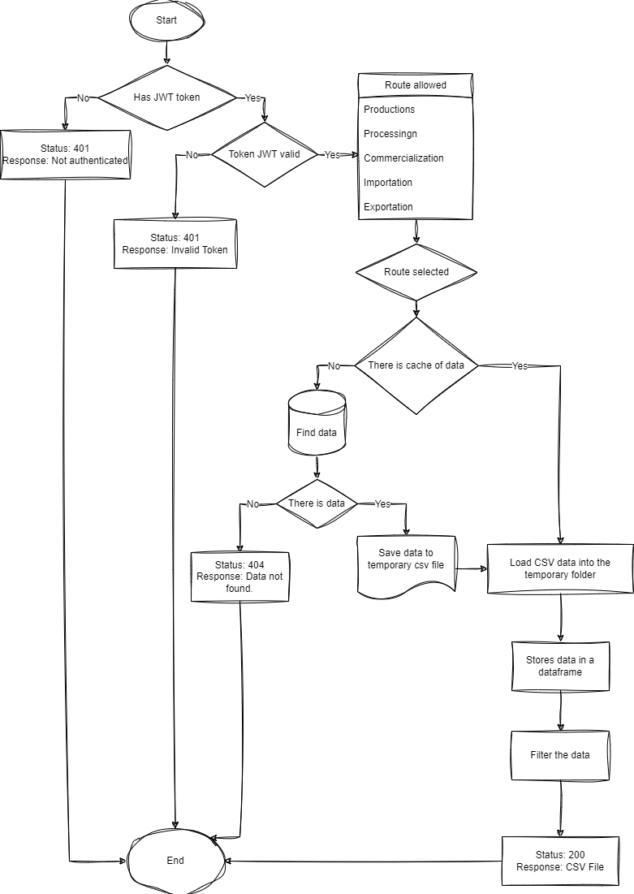

# API Documentation

This document provides an overview of the API routes implemented in the FastAPI application.

## Table of Contents
- [Authentication Routes](#authentication-routes)
- [Data Retrieval Routes](#data-retrieval-routes)
- [Error Handling](#error-handling)
- [Flowchart](#flowchart)

## Authentication Routes

### Register a New User
- **Endpoint**: `POST /auth/register`
- **Description**: Registers a new user on the platform.
- **Request Body**:
  - `name`: `string` - The name of the user.
  - `email`: `string` - The user's email address.
  - `password`: `string` - The user's password.
  - `password_confirm`: `string` - A confirmation for the user's password.
  
- **Response**:
  - **200 OK**: Returns an access token.
    ```json
    {
        "access_token": "token_jwt_generated",
        "token_type": "bearer"
    }
    ```
  - **400 Bad Request**: If the email is already registered.
    ```json
    {
        "detail": "Email already registered. Please choose another valid email."
    }
    ```
  - **422 Unprocessable Entity**: If the password confirmation does not match.
    ```json
    {
        "detail": "The password entered does not match the password confirmation"
    }
    ```

### Login User
- **Endpoint**: `POST /auth/login`
- **Description**: Logs the user into the platform.
- **Request Body**:
  - `email`: `string` - The user's email address.
  - `password`: `string` - The user's password.

- **Response**:
  - **200 OK**: Returns an access token.
    ```json
    {
        "access_token": "token_jwt_generated",
        "token_type": "bearer"
    }
    ```
  - **400 Bad Request**: If the email or password is incorrect.
    ```json
    {
        "detail": "Incorrect email or password"
    }
    ```

## Data Retrieval Routes

### Get Productions Data
- **Endpoint**: `GET /embrapa/productions`
- **Description**: Retrieves production data in CSV format.
- **Query Parameters**:
  - `category`: `string` (optional) - Filter by category.
  - `min_year_date`: `int` (optional) - Minimum year for date filter.
  - `max_year_date`: `int` (optional) - Maximum year for date filter.

- **Response**:
  - **200 OK**: Returns a CSV file with production data.
  - **401 Unauthorized**: If the JWT token is invalid.
  - **404 Not Found**: If no data is found.
  - **422 Unprocessable Entity**: If the filters provided are invalid.

### Other Recovery Routes
The following routes follow the same pattern of parameters and responses:
- `GET /embrapa/processing`
- `GET /embrapa/commercialization`
- `GET /embrapa/importation`
- `GET /embrapa/exportation`

## Error Handling

The API uses standard HTTP status codes to indicate the success or failure of requests. Common error codes include:
- **400 Bad Request**: Indicates a problem with the request (e.g., invalid parameters).
- **401 Unauthorized**: Indicates that authentication is required or failed.
- **404 Not Found**: Indicates that the requested resource was not found.
- **422 Unprocessable Entity**: Indicates validation errors for provided input.

## Usage
To use the API, make sure to include an Authorization header with the bearer token received upon successful login or registration in requests to protected endpoints.

## Flowchart
