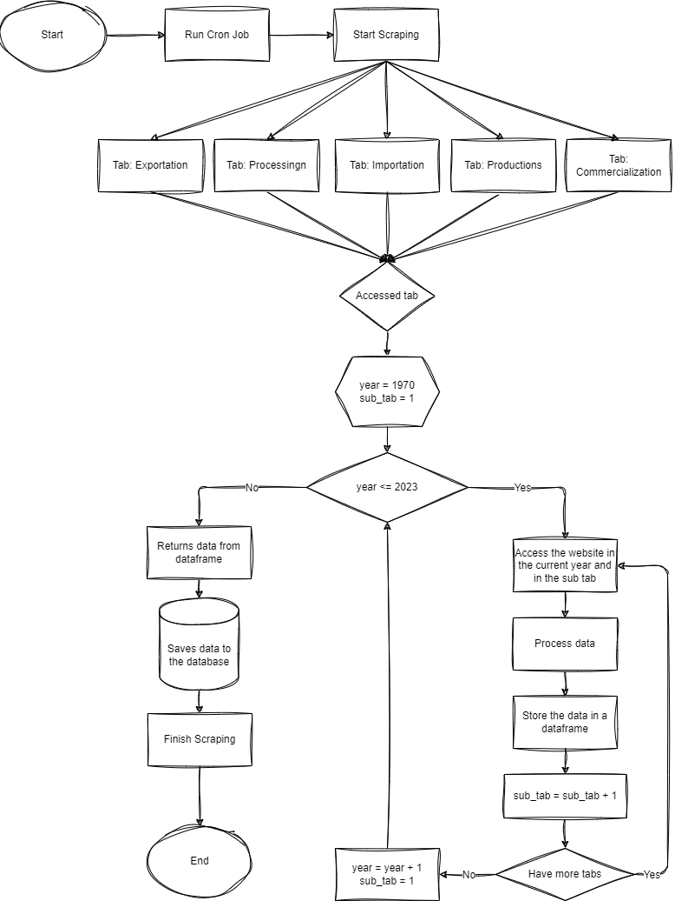

# Cron Job Documentation

## Table of Contents
- [Overview](#overview)
- [Functionality](#functionality)
- [Schedule](#schedule)
- [Execution](#execution)
- [Flowchart](#flowchart)
- [Conclusion](#conclusion)

## Overview

This cron job is designed to automate the process of data extraction from **Site embrapa** using the powerful **Selenium** library. The primary objective is to access various sections of the website, specifically the tabs for **Production**, **Processing**, **Commercialization**, **Importation**, and **Exportation**. 

## Functionality

The cron job performs the following tasks:

1. **Tab Navigation**: It systematically navigates through the designated tabs on the website, ensuring that all relevant data is captured from each section.

2. **Data Extraction**: For each tab, the script reads and collects information spanning from **1970 to 2023**. This historical data collection provides valuable insights and a comprehensive view of the information available.

3. **Data Storage**: Once the data is extracted, it is structured and sent to a **PostgreSQL** database. This ensures that the data is stored securely and can be accessed efficiently for future queries and analysis.

## Schedule

The cron job is scheduled to run **every Saturday at 3:00 AM**. 

## Execution

To execute the script manually, use the following command in the terminal:

```bash
python3 -m cron_jobs.app.scraping
```

## Flowchart


### Conclusion

This cron job serves as a crucial component of our data collection strategy, leveraging Selenium's web scraping capabilities to gather and store historical data effectively. The integration with PostgreSQL provides a robust solution for managing and querying the extracted information.
