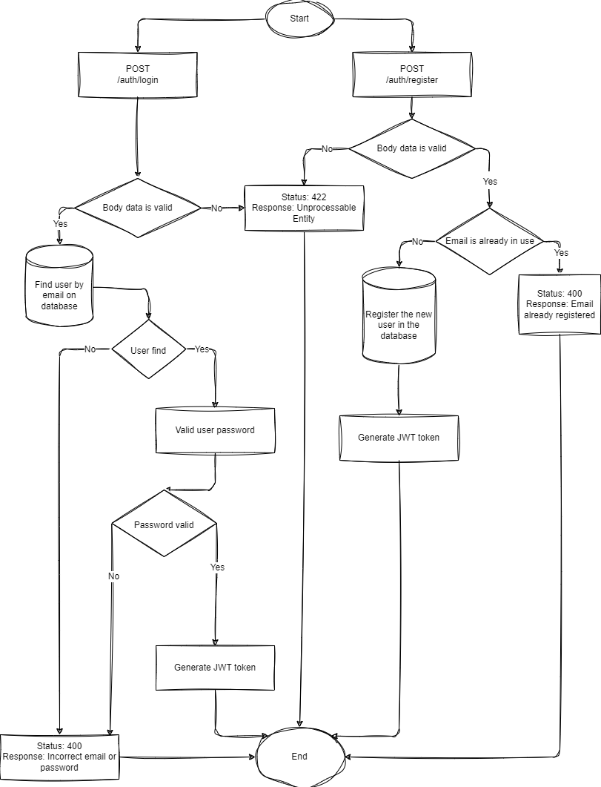
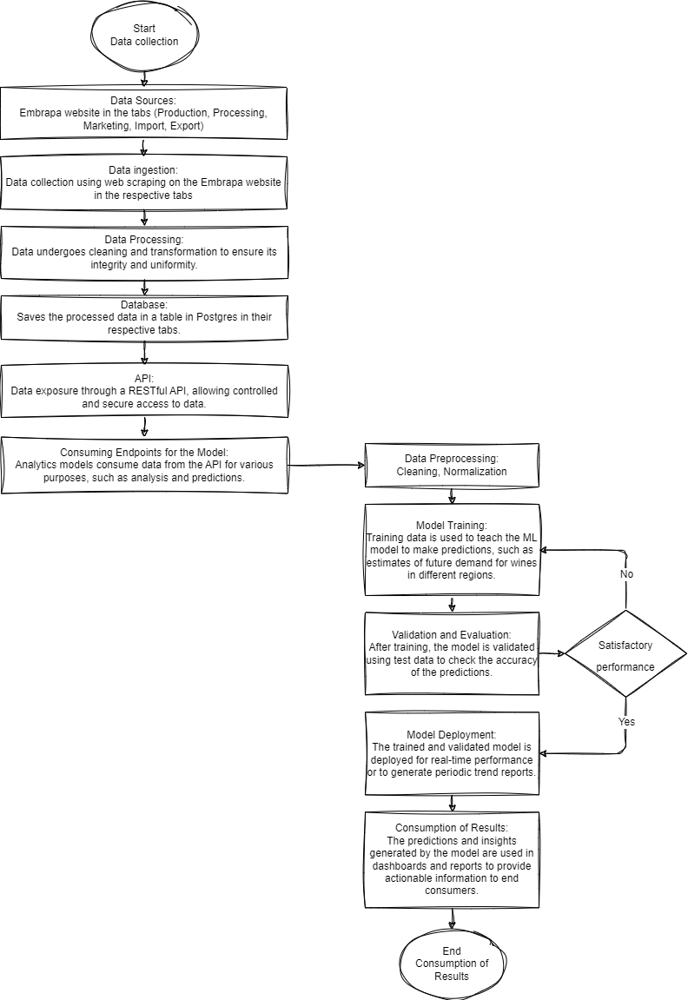

# Project Flowchart

This repository documents the data flow of an API project that provides information on the processing, commercialization, production, export, and import of wines. The project covers everything from raw data ingestion to data preparation for machine learning models. Here you will find detailed flowcharts that illustrate the data flow at each stage of the process.

## Table of Contents
- [Overview](#overview)
- [Data Extraction Flowchart](#data-extraction-flowchart)
- [API Auth Flowchart](#api-auth-flowchart)
- [API Embrapa Route Flowchart](#api-embrapa-route-flowchart)
- [Full Project Flowchart](#full-project-flowchart)

## Overview

The objective of this project is to build a complete wine data pipeline that enables:
1. Extracting data from the Embrapa website.
2. Processing and cleaning this data to ensure consistency.
3. Making the data available through a RESTful API for access by machine learning models.
4. Using this data to feed ML models, generating actionable predictions and insights.

The project is divided into three main flowcharts:
- **Scrape Flowchart**: Demonstrates the data collection process.
- **API Flowchart**: Describes how the API exposes this data for external consumption.
- **Full Flowchart**: Shows the complete flow from ingestion to usage by machine learning models.

---

## Data Extraction Flowchart

This flowchart describes the process of collecting data from the Embrapa website and preparing it for the pipeline.

### Main Steps:
1. **Data Sources**: Raw data is collected from the website.
2. **Data Ingestion**: Automation of the collection process and sending the data to the processing pipeline.
3. **Initial Storage**: Data is stored for the processing stage.

### Image

This flow focuses on the early stages of the pipeline, ensuring that raw data is extracted and prepared for further processing and use.

---

## API Auth Flowchart

This flowchart illustrates the structure of the authentication process within the API, which is essential for protecting access to sensitive data and services. Authentication routes are designed to ensure that only authorized users can access API functionality.

### Main Routes:
1. **User Registration (`POST /auth/register`)**:
   - Endpoint for creating a new user account.
   - Accepts user details such as name, email, and password.
   - Validates the input and creates a new user in the database.
   - If successful, returns an access token (JWT) that must be used in subsequent requests.
   - Returns an error message if register fails.

2. **User Login (`POST /auth/login`)**:
   - Endpoint for user authentication.
   - Requires email and password.
   - Validates the credentials against the stored data.
   - If successful, returns an access token (JWT) that must be used in subsequent requests.
   - Returns an error message if login fails.

### Image

This flowchart provides a visual representation of the authentication routes, illustrating the flow of data and the relationships between the various endpoints. It is crucial for implementing secure access control to the API's resources.

---

## API Embrapa Route Flowchart

This flowchart shows the structure of the API, which makes data available to the ML model and other systems.

### Main Steps:
1. **User Authentication**: Users need an access token, which they obtain by logging in or creating an account.
2. **Data Query**: Authenticated users can query information such as:
   - Processing data
   - Production and commercialization data
   - Export and import data
3. **CSV File Generation**: API responses can be provided in CSV format for easy integration with other tools and analyses.

### Image

This flow documents the main functionalities of the API.

---

## Full Project Flowchart + Future Machine Learning Stage

This flowchart provides an overview of the complete data flow, from collection to usage in machine learning models to generate insights.

### Main Steps:
1. **Data Extraction**: Collection and ingestion of data, as described in the extraction flowchart.
2. **Processing and Storage**: Cleaning and normalizing data before storing it in the central database.
3. **API**: Makes data available for external consumption and machine learning models.
4. **Training and Deployment of Machine Learning Models**:
   - Stored data is used to train ML models.
   - Models generate predictions and insights (such as production and demand trends).
5. **Result Consumption**: Predictions are presented in dashboards or used in analytical reports, allowing wine data to be leveraged to optimize decisions.

### Image

